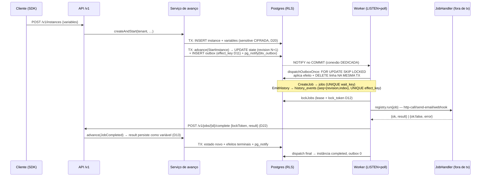

# Sequências do runtime (aceite F2 — "sequências 1 e 2 documentadas")

## Sequência 1 — caminho feliz: start → avanço → outbox → dispatch → job → conclusão



## Sequência 2 — crash na janela crítica, retomada idempotente e timer boundary

```mermaid
sequenceDiagram
  participant ADV as Serviço de avanço
  participant PG as Postgres
  participant W1 as Worker A (morre)
  participant W2 as Worker B (retoma)

  ADV->>PG: TX commitada: estado + efeitos na outbox
  Note over W1: 💀 kill ANTES do dispatch —<br/>efeitos SOBREVIVEM na outbox
  W2->>PG: re-dispatch: mesmas linhas, MESMO effect_key/seq
  Note over PG: UNIQUE(wait_key)/UNIQUE(effect_key)<br/>= zero efeito duplicado
  W1->>PG: (variante) 💀 kill NO MEIO do lote → rollback TOTAL da tx
  W2->>PG: re-dispatch do lote inteiro, idempotente

  Note over W2,PG: Timer boundary (interruptivo)
  W2->>PG: sweepDueTimersOnce: fire_at <= relógio do HOST (D2)
  W2->>ADV: advance(TimerFired{waitKey})
  ADV->>PG: TX: CloseUserTask (task some da Tasklist)<br/>+ rota do boundary + marca timer 'fired' NA MESMA TX (onApplied)
  Note over PG: lease expirada: W2 re-toma o job;<br/>token velho do W1 = 409 (fencing D12).<br/>Efeito defeituoso: SAVEPOINT + backoff 2^n s;<br/>esgotado → dead-letter em incidents.
```

Propriedades que as duas sequências materializam: exatamente-uma-vez por
âncoras de unicidade (não por sorte de timing), `now` sempre do host (D2),
handler fora de transação concluindo pelo contrato público (D22), fencing por
`lock_token` (D12), história determinística `(revision, effect_index)`
(G-DAD-2) e conteúdo pessoal fora do registro histórico (ADR-0002).
